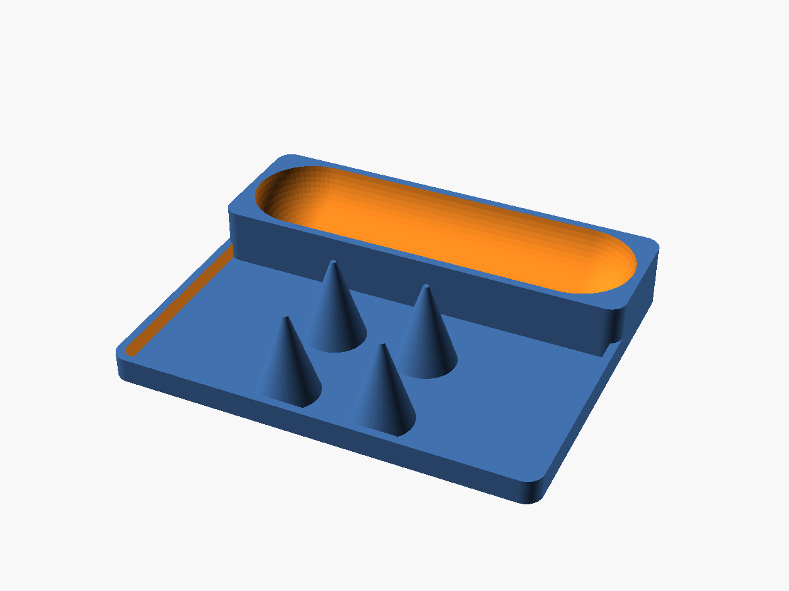

# Dog dental station tray

A small counter tray that holds two things for the dogs' dental routine:

1. **Virbac C.E.T. 2.5 oz toothpaste tube** — rests on its side in a rounded
   cradle (a capsule-shaped valley with rounded ends) so it can't roll off.
2. **Four silicone finger toothbrushes** — sit in a row along the front edge,
   each pushed mouth-down over a tapered **finned drying peg**. The peg is a set
   of radial blades sharing a conical envelope that comes to a point; the blades
   are a few mm wider (across) than the brush opening, so the rim catches partway
   up and stays propped above the floor. The open channels between blades mean
   the brush interior never seals — air flows in and water drains straight down
   and out, so the brushes dry inside and out. (A solid cone would seal a closed
   pocket at the rim and trap water; the fins are what prevent that.)



```
   back  +-----------------------------------+
         |  \_______________________________/ |   toothpaste cradle (rounded valley)
         |                                     |
   front |    *      *      *      *           |   4 finned drying pegs, in a row
         +-----------------------------------+        (longways beside the cradle)
```

Footprint with the default parameters: **152 mm (L) x 90 mm (W) x 33 mm (H)**.
(Verified from the exported STL: watertight / manifold.)

## Source of truth

`src/dog-dental-tray.scad` — fully parametric. Every fit number is at the top of
the file with units; everything else is derived. No external libraries.

## Measurements — verify against your actual items

The defaults are reasonable estimates, **not** measured off the real products.
Before printing, measure yours and update the params:

| Param          | Default | What to measure |
|----------------|---------|-----------------|
| `tube_len`     | 140 mm  | tube length lying flat, cap included |
| `tube_dia`     | 36 mm   | widest diameter of the full tube |
| `peg_base_dia` | 22 mm   | set a few mm **larger** than the brush opening's inner diameter |
| `peg_height`   | 30 mm   | a bit taller than the brush is deep |
| `peg_pitch`    | 34 mm   | brush spacing (leave finger room to grab) |
| `peg_fins`     | 4       | blades per peg (more = more support, narrower channels) |
| `fin_thk`      | 3 mm    | blade thickness |

Tuning the fit:
- **Cradle too tight / loose** -> adjust `cradle_clear` (air gap around the tube).
- **Tube hard to lift out** -> make `grip` more negative (walls stop lower).
- **Brushes slide all the way to the floor** -> increase `peg_base_dia` so the
  rim catches higher up the fins.
- **Brush wobbles / channels too tight** -> raise `peg_fins` (e.g. 6) or `fin_thk`.
- **Sharper point** -> lower `peg_tip_dia` toward ~1 mm. 2 mm is the printable
  default; a true zero point strings/curls.

## Build

```
just build      # -> export/dog-dental-tray.stl
just preview    # -> images/preview.png (headless render via xvfb-run)
just clean
```

`just build` calls the apt OpenSCAD 2021.01 on PATH. Use a different binary with
`OPENSCAD=/path/to/AppImage just build`.

## Print settings

_TBD — fill in after the first print._

- **Material:** PETG suggested (bathroom moisture / water contact; PLA works but
  softens if left wet long-term).
- **Orientation:** print as modeled, flat on the base — **no supports needed**.
  The cradle is a concave scoop (a top surface) and the pegs are tapering towers,
  both overhang-free.
- Layer height / infill / walls: _record what worked._
- Drop a photo of the finished print in `images/`.

## Design notes

- One union of three pieces: base plate + low catch rim, the cradle block (the
  valley is a `hull()` of two spheres -> rounded ends), and a row of finned pegs
  (each = a cone envelope `intersection()`-ed with crossing slabs -> open blades).
- The catch rim contains drips; wipe the tray out occasionally. If you'd rather
  it self-drain, add through-holes in the peg zone or set corner feet — both are
  easy one-parameter follow-ons.
